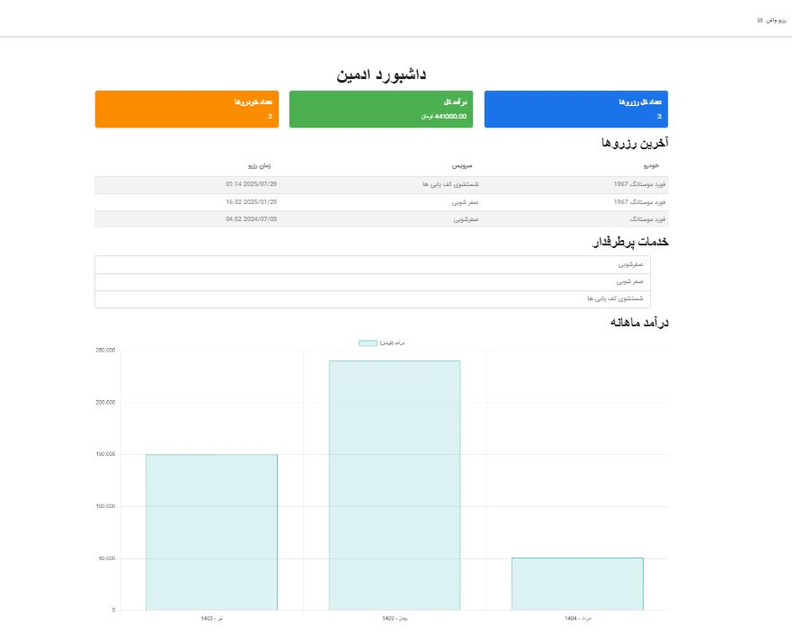
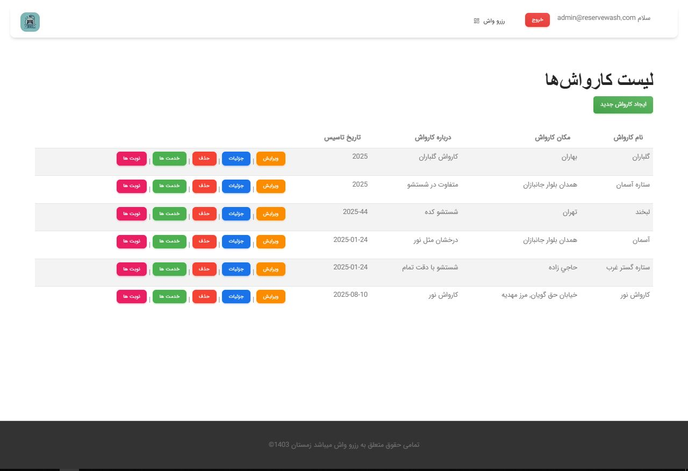
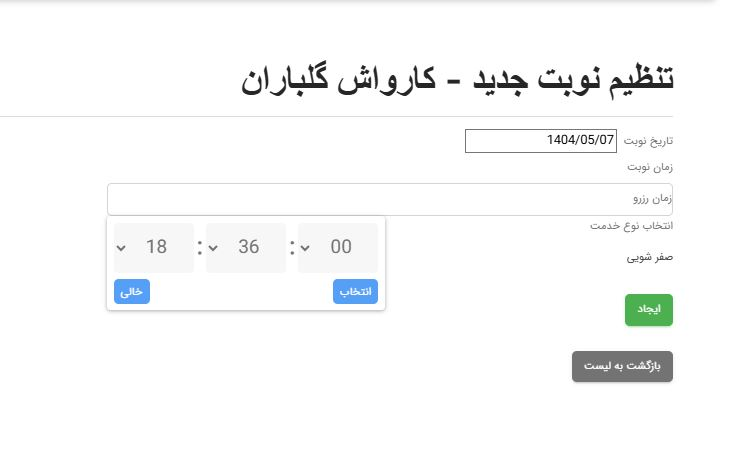

# Reservash - A Car Wash Reservation System

## 📜 Introduction & Context

This project was developed as my undergraduate final project, serving as my first significant application built with **ASP.NET Core 6 MVC**. It represents a major step in my transition to modern .NET technologies and cloud-ready architectures.

The primary goal was to build a functional, real-world application for a car wash business, handling everything from user management and authentication to service reservations and data visualization. This project was a crucial learning ground where I implemented several key patterns and explored new technologies.

**Note on Language:** The user interface (UI) for this project was developed in Persian (Farsi). The visuals below provide an overview of the application's features, and all backend code is in English.

---

## ✨ Features & Visuals

**Live Demo (GIF):**
*A short GIF demonstrating a core user flow, such as making a reservation.*


**Key Screenshots:**
<p align="center">
  
  
  
</p>
<p align="center">
  <em>(Left: The main admin dashboard with charts and stats. Right: A reservation forms with interactive components.)</em>
</p>

- **Data-Driven Admin Dashboard:** A comprehensive dashboard for administrators showing key metrics like total reservations, income, and popular services, including a monthly income chart powered by **Chart.js**.
- **Full Authentication & Authorization:** Implemented a complete user management system using **ASP.NET Identity** for secure registration, login, and role-based access control.
- **Interactive Map Integration:** Integrated the **OpenStreetMap** API (via Leaflet.js with jQuery) to allow users to select their location visually.
- **Rich Form Components:** Utilized components like interactive date pickers to create a smooth and intuitive user experience for making reservations.

---

## 🏛️ Architecture & Technical Highlights

This project was built with a strong emphasis on modern, decoupled design patterns.

- **Generic Repository Pattern:** To avoid repetitive data access code, I implemented a Generic Repository (`IGenericRepository<T>`). This significantly accelerated development by centralizing data access logic.
- **Efficient Object Mapping:** Used the **Mapster** library for high-performance, convention-based object-to-object mapping, cleanly separating domain models (Entities) from ViewModels.
- **Code-First Database with EF Core Migrations:** The database schema is managed entirely through code using **Entity Framework Core**. The database can be created and updated from scratch using EF Core's migration commands.
- **Exploration in Machine Learning:** An experimental feature was partially developed using **ML.NET** to predict peak reservation times, demonstrating an initiative to explore and integrate cutting-edge technologies.

### 🎓 Reflection & Lessons Learned
The main architectural lesson from `Reservash` was the need for a dedicated **Business Logic Layer (BLL)**. Although the Repository Pattern successfully separated data access, the business logic was often placed directly within the controllers. This experience was the final confirmation I needed to fully embrace **Clean Architecture** in my next project, `DefenSys`, to achieve a truly separated and highly testable application core.

---

## 🛠️ Technology Stack

- **Backend:** C#, ASP.NET Core 6 MVC, Entity Framework Core, ASP.NET Identity, ML.NET
- **Frontend:** HTML, CSS, Bootstrap (with custom styles), JavaScript, jQuery, Chart.js
- **UI Theme:** Based on Material Design principles.
- **Mapping:** Mapster
- **Database:** Microsoft SQL Server

---

## 🚀 Getting Started / Setup Guide

### Prerequisites

- .NET 6 SDK
- Visual Studio 2022
- A local or remote SQL Server instance

### Installation Steps

1.  **Clone the repository:**
    ```bash
    git clone [https://github.com/rezarajaei-io/ReserveWash.git]
    ```

2.  **Configure the database connection:**
    - Open the `appsettings.json` file.
    - Update the `DefaultConnection` connection string to point to your SQL Server instance.

3.  **Apply Database Migrations:**
    - Open the Package Manager Console in Visual Studio.
    - Ensure the main web project is selected as the "Default project".
    - Run the following command to create and update the database schema:
        ```powershell
        Update-Database
        ```

4.  **Run the Application:**
    - Press `F5` or the Run button in Visual Studio to start the project.
